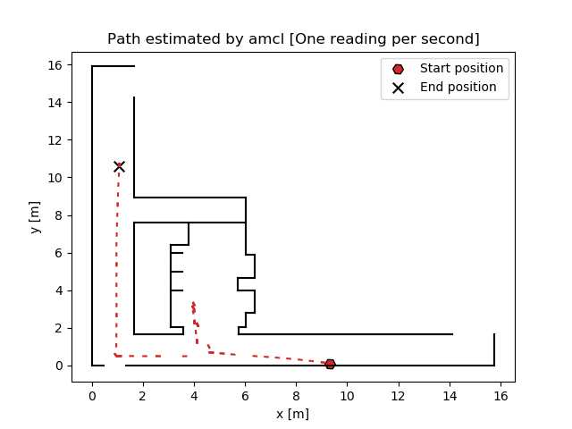

# Monte Carlo Localization for Pioneer 3D-X Robot

This repository contains the implementation of the Monte Carlo Localization algorithm, also known as the Particle Filter, applied to the Pioneer 3D-X robot for autonomous localization within a known map. The project was developed as part of the Autonomous Systems course by Group 14, including contributions from Diogo Araujo, Gonçalo Mesquita, Paulo Cruz, and Sebastião Melo.

## Project Overview

The goal of this project was to accurately localize a wheeled robot within a known environment using both synthetic and real data. The robot is equipped with a laser for measuring distances to obstacles and an odometry sensor for tracking movement. Due to sensor noise, the Monte Carlo Localization algorithm was employed to estimate the robot's position with high accuracy.

## Implementation Details

- **Particle Filter Algorithm**: Utilizes a three-step process (prediction, update, and resampling) to estimate the robot's position based on sensor readings and movement.
- **Models**: Includes both odometry and measurement models, which take into account the noise and inaccuracies inherent in real-world data.
- **Simulation and Real-world Data**: Tests were conducted using both synthetic data generated through micro-simulation and real data collected from the Pioneer 3D-X robot.

<!-- ## Getting Started

To run the localization algorithm:

1. Clone the repository.
2. Install the required dependencies listed in `requirements.txt`.
3. Execute the main script to start the localization process using synthetic or real data. -->

## Micro Simulator Demo

Watch the video demonstration of the Micro Simulator in action:

## Real Data Demonstration

### Trajectory Overview

First, we showcase the planned trajectory that the Pioneer 3D-X robot is expected to follow:

### Particle Filter Algorithm in Action

Next, observe the Particle Filter Algorithm working with real data:

### Error Analysis

Finally, we present a plot showcasing the Mean Squared Error (MSE) of the localization error:

## Results

The project successfully demonstrates the use of the Monte Carlo Localization algorithm to localize the Pioneer 3D-X robot with high precision. The algorithm proved to be robust, accurately localizing the robot in various scenarios and conditions.

For detailed information on the algorithm, implementation, and results, please refer to the included paper.

## References

Included in the repository are references to essential resources and readings that were instrumental in the development of this project.

## Contributors

- Diogo Araujo
- Gonçalo Mesquita
- Paulo Cruz
- Sebastião Melo

